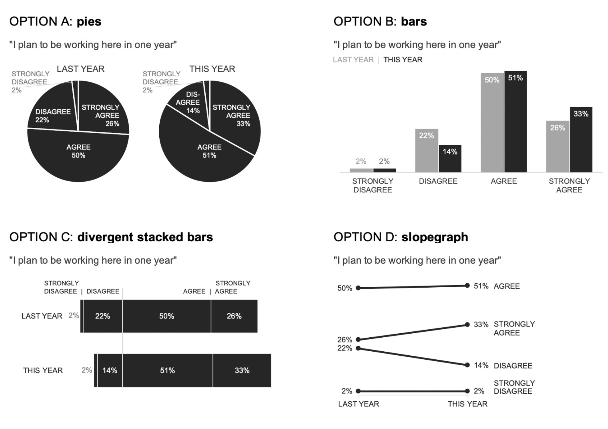
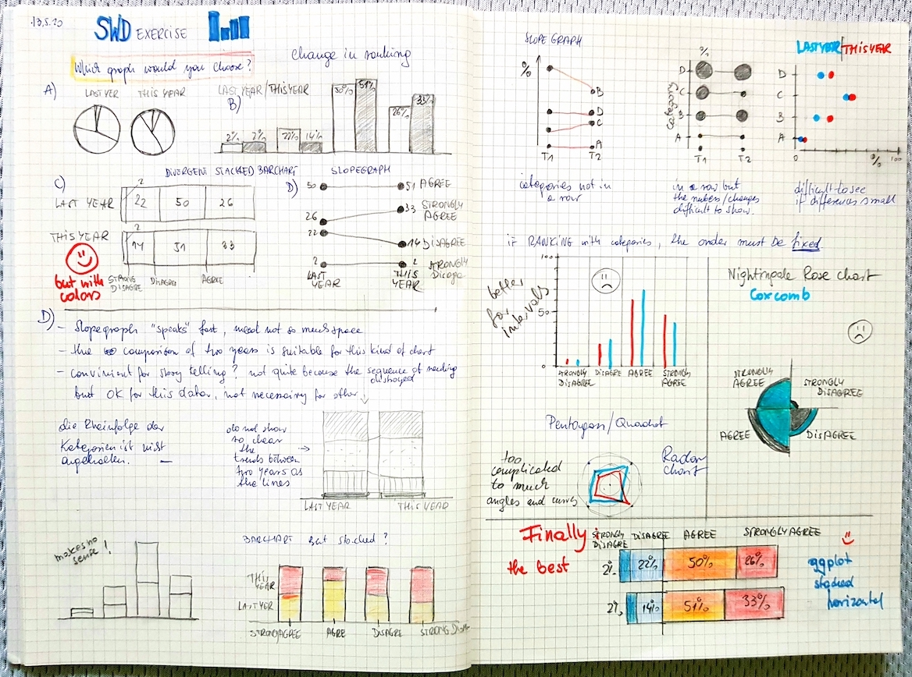

An exercise form *Stroytelling With Data* posted by [Cole Nussbaumer Knaflic](https://community.storytellingwithdata.com/exercises/which-graph-would-you-choose) "translated" to and performed in R.


```{r setup, include = FALSE}
# Load relevant packages
library(pacman)
p_load(tidyverse,  kableExtra, scales, ggrepel, forcats)
```

# INSTRUCTIONS

Any set of data can be graphed many ways and varying views allow us to see different things. Let's look at a specific instance of numerous graphs plotting the same data.

Let's imagine you are visualizing data from your employee survey and want to show how employees responded this year compared to last year to the retention item "I plan to be working here in one year." Below, you'll see four different views of the exact same data. Spend some time examining each, then complete the steps that follow.
<br>
```{r echo = FALSE, warning = FALSE, message = FALSE, fig.cap = paste("Fig. 1: Graph options for conideration provided by Cole Nussbaumer Knaflic.")}
# Include graphics

```
<br>

**STEP 1:** List a pro (something you like or that works well) and a con (an aspect that is not ideal) for each of the four options.

**STEP 2:** Assume you are tasked with communicating this data. Which would you choose? Title your solution with your preferred graph type (from the provided choices or beyond).

**STEP 3:** Color and words were intentionally not employed in these visuals (beyond those necessary to decipher the data) so you'd focus on the graphical form. However, if you were communicating it, you'd likely take additional steps using these design components to make things clear for your audience. Sketch or create in your tool your ideal visual for communicating this information [if you'd like, you can download the data](https://drive.google.com/file/d/1O3i72-Ks5cJTv9fwnzh06YKq0m4jCnzp/view), making assumptions freely as needed to drive your decisions. Submit this visual and related commentary from the prior steps as your solution.
<br>

# DATA

```{r echo = FALSE, warning = FALSE, message = FALSE}
# Data frame
exercise_2.12 <- data.frame(
                RESPONSE = 	c("STRONGLY AGREE", "AGREE", "DISAGREE", "STRONGLY DISAGREE"),
                LAST_YEAR	= c(0.26, 0.5, 0.22, 0.02),
                THIS_YEAR = c(0.33, 0.51, 0.14, 0.02)) 

kable(exercise_2.12)

```
<br>

# CONSIDERATIONS

```{r echo = FALSE, warning = FALSE, message = FALSE, fig.cap = paste("Fig. 2: Looking for graph options.")}
# Include graphics

```
<br>


# EFFECTIVE VISUAL

**Divergent stacked bars** clearly communicate the results of a survey. The order of the categories is maintained. Different colors distinguish the negative and positive categories.


```{r echo = FALSE, warning = FALSE, message = FALSE, fig.height = 4, fig.width = 10, fig.cap = paste("Fig. 3: Effective visual for rating data")}
# chart code
    exercise_2.12 <- data.frame(
                RESPONSE = 	c("STRONGLY AGREE", "AGREE", "DISAGREE", "STRONGLY DISAGREE"),
                LAST_YEAR	= c(0.26, 0.5, 0.22, 0.02),
                THIS_YEAR = c(0.33, 0.51, 0.14, 0.02)) 

    exercise_data <- exercise_2.12 %>% 
                     gather("period", "percentage", -RESPONSE) %>% 
                     mutate(div_perc = ifelse(RESPONSE %in% c("DISAGREE", "STRONGLY DISAGREE"), -percentage, percentage),
                            RESPONSE = factor(RESPONSE, levels = c("STRONGLY AGREE", "AGREE", "STRONGLY DISAGREE", "DISAGREE")),
                            period = factor(period, levels = c("LAST_YEAR",  "THIS_YEAR")))
    exercise_data$period <- recode_factor(exercise_data$period, "LAST_YEAR" = "LAST YEAR", "THIS_YEAR" = "THIS YEAR")
  
    base.size <- 20
    base.family <- "Source Sans Pro"

    #pal_stacked_rating <- c("#80BD9E", "#ADD5C1", "#CAE4D7", "#DADADA", "#FFBFCA", "#FF9BAC", "#FF3C5C")
    pal_stacked_rating <- c("#80BD9E", "#ADD5C1", "#FF9BAC","#FF3C5C")

     ggplot(exercise_data, aes(x = fct_rev(period), y = div_perc, fill = RESPONSE)) +
                geom_col(color = "white") +
                coord_flip() +
                scale_fill_manual(values = pal_stacked_rating, 
                                  breaks = c("STRONGLY AGREE", "AGREE", "DISAGREE", "STRONGLY DISAGREE")) +
                scale_y_continuous(labels = percent_format(accuracy = 1), 
                                  expand = c(0, 0.04, 0, 0), breaks = (0)) +
                geom_hline(aes(yintercept = 0), size = 1.2) +
                theme_void() +
                theme(axis.text = element_text(size = 16, family = base.family, face = "bold"),
                      #axis.line.y = element_line(size = 1, colour = "black"),
                      axis.line = element_blank(),
                      legend.position = "top",
                      legend.justification = c(0.15, 0), 
                      legend.key.height = unit(0.5, "cm"),
                      legend.key.width = unit(1, "cm"),
                      legend.title = element_blank(),
                      legend.text = element_text(angle = 0, size = 14, hjust = -1, vjust = 0.5, 
                                                 face = "bold", family = base.family,
                                                 margin = margin(l = -5, r = 5, unit = "pt")),
                      #panel.grid.major.x = element_line(color = "black", size = 0.2),
                      
                      plot.margin = unit(c(0.1, 1.5, 1, 0.3), "cm"),
                      plot.title = element_text(size = base.size, family = base.family, face = "bold", hjust = -0.7,
                                                margin = margin(t = 10, unit = "pt")),
                      plot.subtitle = element_text(size = base.size-5, family = base.family, face = "bold")) +
                geom_text_repel(aes(label = paste0(round(percentage*100, 2), "%")),
                          position = position_stack(0.5), force = 0.01, #hjust = -0.01, 
                          family = base.family, size = 6, color = "black", face = "bold") +
                guides(fill = guide_legend(nrow = 1, reverse = TRUE)) +
                ggtitle("Survey statement: I plan to be working here in one year\n"#, subtitle = "Divergent stacked bars\n"
                        )

```
Fig. 3: Effective visual for rating data
<br>


